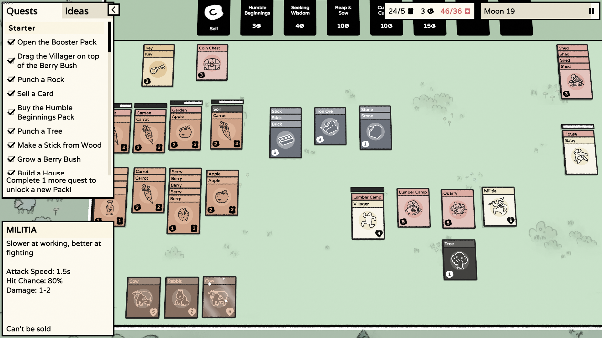
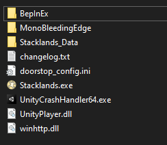

# Higher UI
## About
Increases the height of sidebar elements.

## Config
Both quests+ideas sidebar and info sidebar height can be set individually.
The config entries are generated after the first start at `BepInEx/config/com.maxsch.stacklands.higherui.cfg`.

## Installation
This mod requires BepInEx to work, it is a modding framework that allows multiple mods being loaded.
Furthermore, this mod uses Harmony to patch into the game, which means no game code is distributed and allows multiple mods to change it interdependent.

1. Download BepInEx from https://github.com/BepInEx/BepInEx/releases 
2. Extract all files to your Stacklands folder. It should look like this:\

3. Download this mod and extract it into `BepInEx/plugins/`
4. Launch the game! If everything works, you should already see that the height of the sidebar elements is increased.

## Useful Tools
- ConfigurationManager (https://github.com/BepInEx/BepInEx.ConfigurationManager/releases): Adds the ability to change the config at runtime.

## Development
1. Install BepInEx
2. Set your `GAME_PATH` in `StacklandsHigherUI.csproj`
3. This mod requires publicized game code, this removes the need to get private members via heavy Reflection code. Use https://github.com/CabbageCrow/AssemblyPublicizer for example to publicize `Stacklands/Stacklands_Data/Managed/GameScripts.dll`
4. Compile the project. This copies the resulting dll into `<GAME_PATH>/BepInEx/plugins/`
